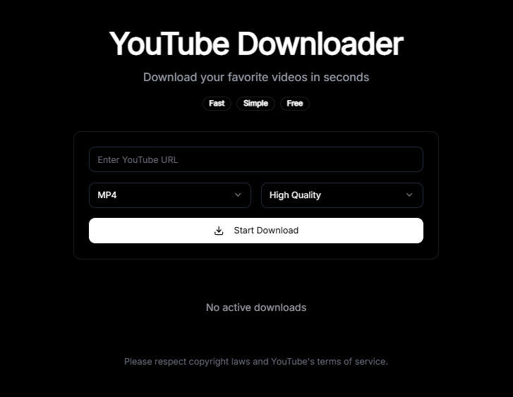

# Simple YouTube Downloader

A powerful and user-friendly YouTube video downloader built with Python FastAPI and React. Download your favorite YouTube videos in multiple formats and qualities with a beautiful, responsive interface.



## Features

- 🎥 Download YouTube videos in multiple formats (MP4, WebM, MP3, M4A)
- ⚡ Fast downloads with real-time progress tracking
- 🎨 Beautiful, responsive glassmorphic UI
- 🎵 Audio extraction support
- 🎬 Multiple quality options (High, Medium, Low)

## Tech Stack

- **Backend**: Python FastAPI + yt-dlp
- **Frontend**: React + TypeScript
- **UI**: Tailwind CSS + shadcn/ui
- **Video Processing**: FFmpeg

## Setup Instructions

1. Clone the repository:
```bash
git clone https://github.com/paulelliotco/SimpleYTDownloader.git
cd SimpleYTDownloader
```

2. Install dependencies:
```bash
# Install Node.js dependencies
npm install

# Install Python dependencies
pip install -r requirements.txt
```

3. Start the development server:
```bash
npm run dev
```

4. Open http://localhost:5000 in your browser

## Requirements

See [requirements.txt](./requirements.txt) for Python dependencies.

## License

MIT License
